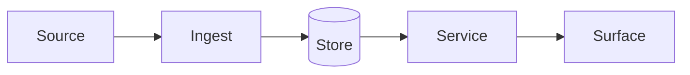

# Architecture

> Fill this in as you build. It is the document you will screen-share in a
> system-design interview, so write it for that audience.

## Context

Why this system exists, who uses it, and what they do instead today.

## Container view

The major runtime pieces and how they talk. Keep the diagram in Mermaid so it
reviews well in a pull request.

## Key decisions

Record each significant choice, the alternatives considered, and the reason —
one short section each. The differentiator in the README should appear here as
a decision with its trade-offs spelled out.

## Failure modes

What breaks, how you detect it, and what the system does instead of lying.

## What is out of scope

Name it explicitly. Scope discipline reads as seniority.
